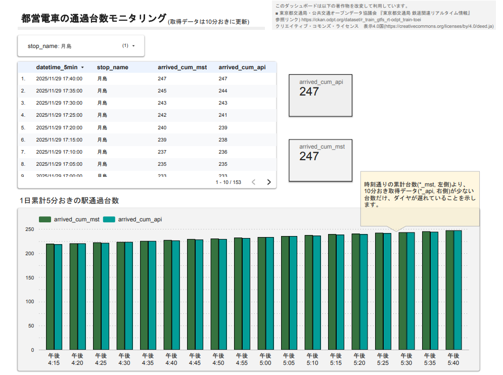
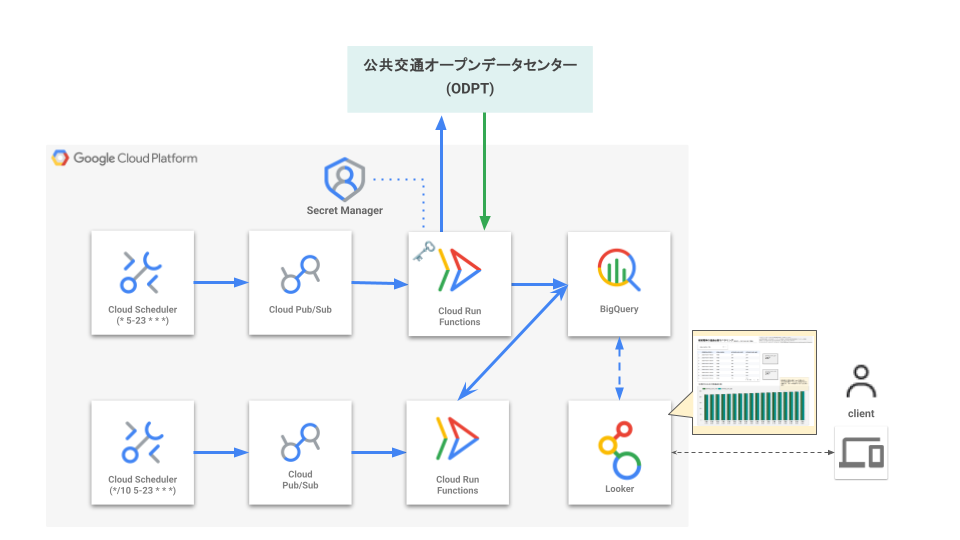

# 都営駅の運行情報モニタリングボード

> [!IMPORTANT]
> 本リポジトリは個人の成果物です。
> いづれの事業者様へのお問い合わせ等はお控え願います。

東京都が運営している各駅の1日累計通過台数がモニタリングできます

ダッシュボード公開ページは[こちら](https://lookerstudio.google.com/reporting/a3958462-46b1-41e8-9f7f-53a0548be721)

# 🚪API提供元
- 公共交通オープンデータセンター(ODPT)
    - https://www.odpt.org/
    - うち、[鉄道関連リアルタイム情報](https://ckan.odpt.org/dataset/r_train_gtfs_rt-odpt_train-toei/resource/ab773be1-aab7-47f2-8cd7-1ddbd9d8c8b9)と[鉄道関連情報](https://ckan.odpt.org/dataset/train-toei/resource/35b68908-4558-47ae-bfa5-867e58544a1a)を参照しています

## APIフォーマット
- プロトコルバッファ(Protocol Buffers)
    - https://gtfs.org/ja/documentation/realtime/reference/
    - 開発時に参考したサイト) https://nttdocomo-developers.jp/entry/20231218_1

# 使用言語・環境

- Python
- Google Cloud
    - 🕜Cloud Scheduler
    - ⚙️Cloud Run Functions
    - 🗝️Secret Manager
    - 🪣BigQuery
    - 📊Looker Studio

# 🔁ワークフロー概観
主に2つの処理で構成されています
- 🟦逐次的にAPIを叩き、当該時間断面の車両位置情報を取得して貯蓄
- 🟩貯めたAPIレスポンスを束ねて加工し、ダッシュボーディング

🟦**APIリクエストとDWHへの保存**
1. 1分おきにAPIリクエスト
2. APIレスポンスをパースして表形式に
3. DWHに日付ごとのテーブルへ逐次append

🟩**貯めたAPIレスポンスを束ねて加工し、ダッシュボーディング**
1. 日付ごとのテーブルを参照し、当該時間断面まで貯めた駅通過台数を得る
2. 加工した運行マスタと突合させ、駅×時刻の1日累計通過台数な表を作成
3. 作成した表を別途DWHにreplaceし、BIツールが参照する表が更新される
